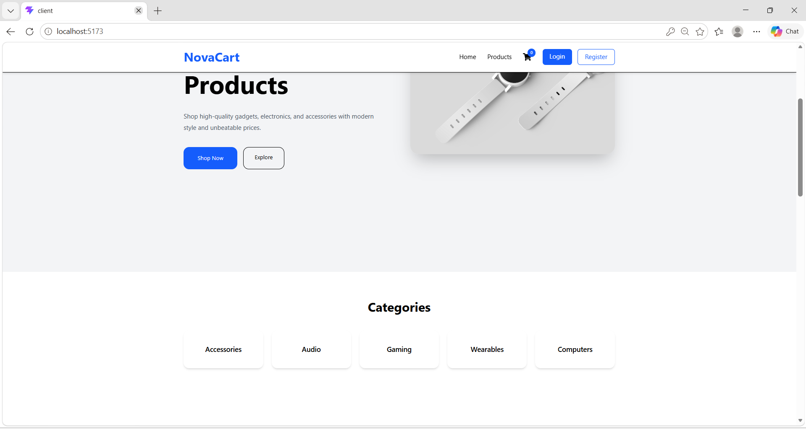
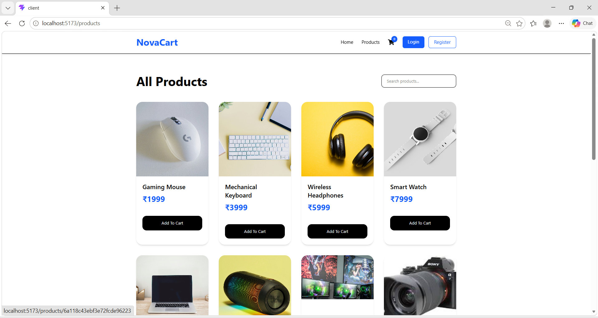
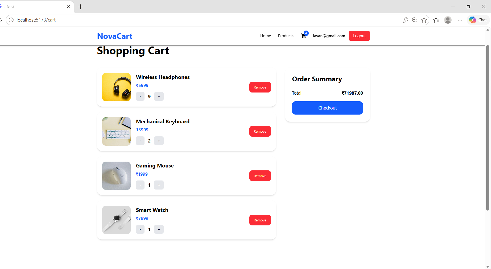
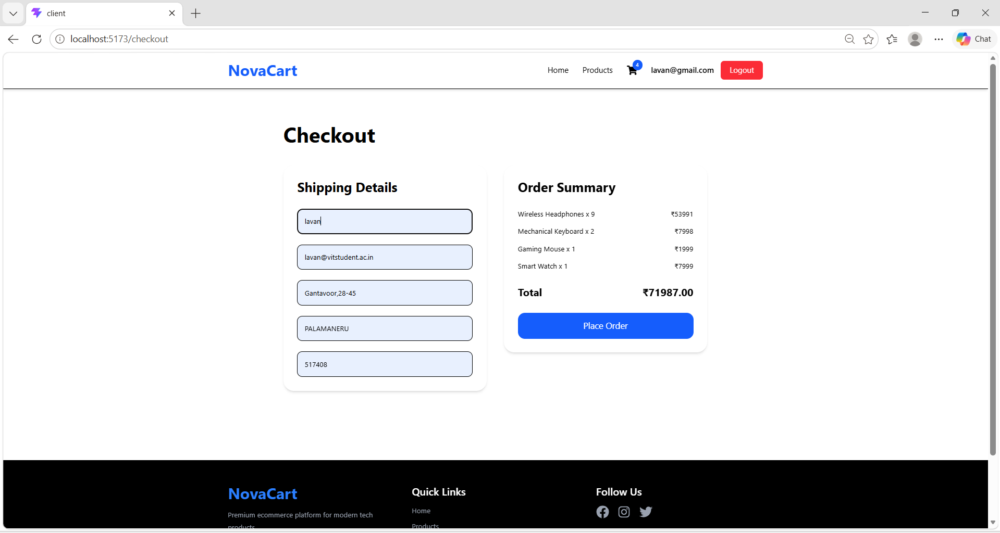

# NovaCart – Full Stack E-Commerce Web Application

NovaCart is a modern full-stack E-Commerce web application built using the MERN Stack (MongoDB, Express.js, React.js, Node.js).

The platform provides a complete online shopping experience where users can browse products, filter categories, search items, manage carts, and place orders through a responsive and user-friendly interface. The application also includes admin functionality for managing products dynamically using MongoDB.

---

# Features

## User Features

- User Registration & Login Authentication
- Browse All Products
- Product Details Page
- Product Search Functionality
- Category-Based Product Filtering
- Shop Deals Section
- Add to Cart Functionality
- Increase / Decrease Product Quantity
- Persistent Cart for Each User
- Checkout System
- Order Success Page
- Responsive Design for Mobile & Desktop

---

## Admin Features

- Admin Login Access
- Add New Products
- Dynamic Product Management
- MongoDB Product Storage

---

# Tech Stack

## Frontend

- React.js
- Tailwind CSS
- React Router DOM
- Redux Toolkit
- Axios

## Backend

- Node.js
- Express.js

## Database

- MongoDB
- MongoDB Compass

---

# Project Structure

```bash
client/
server/
```

---

# Installation & Setup

## Clone Repository

```bash
git clone <your-github-repository-link>
```

---

## Frontend Setup

Open terminal inside the `client` folder:

```bash
cd client
npm install
npm run dev
```

Frontend runs on:

```bash
http://localhost:5173
```

---

## Backend Setup

Open terminal inside the `server` folder:

```bash
cd server
npm install
npm run server
```

Backend runs on:

```bash
http://localhost:5000
```

---

# MongoDB Setup

Open MongoDB Compass and create:

## Database

```bash
ecommerce
```

## Collection

```bash
products
```

---

# Environment Variables

Create a `.env` file inside the `server` folder.

```env
PORT=5000

MONGO_URI=your_mongodb_connection_string

JWT_SECRET=your_secret_key
```

---

# API Endpoints

## Authentication APIs

### Register User

```http
POST /api/auth/register
```

### Login User

```http
POST /api/auth/login
```

---

## Product APIs

### Get All Products

```http
GET /api/products
```

### Add Product

```http
POST /api/products
```

---

# Postman API Testing

## Register API

```http
POST http://localhost:5000/api/auth/register
```

### Request Body

```json
{
  "name": "John",
  "email": "john@gmail.com",
  "password": "123456"
}
```

---

## Login API

```http
POST http://localhost:5000/api/auth/login
```

### Request Body

```json
{
  "email": "john@gmail.com",
  "password": "123456"
}
```

---

## Add Product API

```http
POST http://localhost:5000/api/products
```

### Request Body

```json
{
  "name": "Gaming Laptop",
  "price": 89999,
  "image": "image_url",
  "category": "Computers",
  "description": "High performance gaming laptop",
  "countInStock": 10
}
```

---

# Main Pages

- Home Page
- Products Page
- Product Details Page
- Cart Page
- Checkout Page
- Order Success Page
- Login Page
- Register Page
- Admin Add Product Page

---

# Screenshots

## Home Page



## Products Page



## Cart Page



## Checkout Page



---

# Future Improvements

- Online Payment Integration
- Product Reviews & Ratings
- Wishlist Functionality
- Order History
- Admin Dashboard
- Product Image Upload Feature

---

# Deployment

## Frontend

- Vercel
- Netlify

## Backend

- Render
- Railway

---

# Learning Outcomes

This project helped in understanding:

- Full Stack MERN Development
- REST API Integration
- MongoDB Database Management
- Authentication Systems
- Redux Toolkit State Management
- Responsive UI Development
- E-Commerce Application Architecture

---
